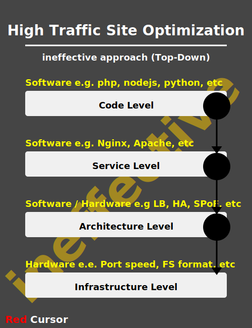
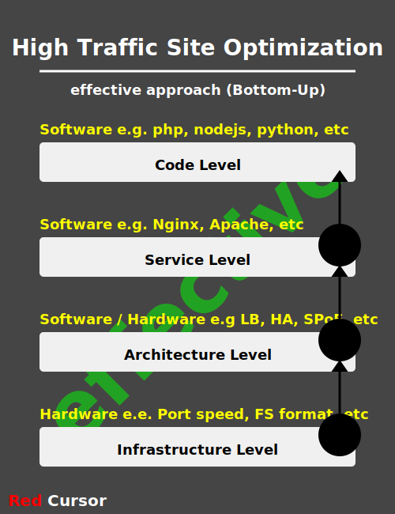

# high-traffic-site-optimization

Tools, techniques, principles, patterns and designs to have a high-performance Linux server.

## Two main approaches to apply optimization
Here are two ways to try to optimize a website; we have **top-down** and **bottom-up**.
in top-down approach people debate about which programming language is faster. They say
**WordPress** is slow and **ReactJS** is faster; which is true.  
**Python** is faster and **NodeJS**, yes true.  
So the point is, for having a really fast website, just *a faster programming language* cannot
help so much. For any website to function (be loaded) we have there four levels (layers):  
1. code level (php, go, python, etc)
2. service level (Apache, Nginx, LiteSpeed, etc)
3. architecture level (HA, LB, etc)
4. infrastructure level (network, dedicated server, VM, containers, etc)

We tested and realized that the same code, but in different **DataCenter** has different speed.
Just changing the DataCenter. So when we can apply optimization from *top to bottom* (which works)
we can apply it from *bottom-to-up* which is more effective.  

We are going to cover there four layers and provide solutions for each laster and improve overall
performance of the website we have.

**NOTE**  
SVGs are used to better demonstration.


### Top-Down (ineffective)

<p align="center">
    
</p>

### Bottom-Up (effective)

<p align="center">
    
</p>

<hr>

### Infrastructure
Check / test your infrastructure  

#### dmidecode
dmidecode - DMI table decoder  
dmidecode  is a tool for dumping a computer's DMI (some say SMBIOS) table contents in a human-readable format. 

Usage
`dmidecode --type | -t`  
options
```
bios
system
baseboard
chassis
processor
memory
cache
connector
slot
```
There of the are more useful  
```
sudo dmidecode --type system
sudo dmidecode --type processor
sudo dmidecode --type memory
```


Test on a dedicated #server (`sudo dmidecode --type system`)
```
System Information
Manufacturer: HP
Product Name: ProLiant DL360 G7
Version: Not Specified
Serial Number: ...
...
Family: ProLiant
```

Test on a Virtual Server in Hetzner (`sudo dmidecode --type system`)
```
System Information
Manufacturer: Hetzner
Product Name: vServer
Version: ...
Serial Number: ...
...
Family: Hetzner_vServer
```

#### lshw
lshw - list hardware

First see all available options, sample output:
```
>>> sudo lshw |& grep '\*-[a-z]\+'
  *-core
     *-cache:0
     *-cache:1
     *-cache:2
     *-cache:3
     *-cpu
     *-memory
        *-bank:0
        *-bank:1
        *-bank:2
        *-bank:3
     *-firmware
     *-pci
        *-display
        *-usb
           *-usbhost:0
              *-usb:0
              *-usb:1
           *-usbhost:1
        *-generic
        *-communication:0
        *-communication:1
        *-storage
        *-isa
        *-memory UNCLAIMED
        *-multimedia
        *-serial UNCLAIMED
        *-network
     *-scsi:0
        *-disk
           *-volume:0
           *-volume:1
           *-volume:2
              *-logicalvolume
           *-volume:3
     *-scsi:1
        *-cdrom
  *-power UNCLAIMED
```

Four useful ones are `cpu, memory, disk, network` which we can see using `-class` arguments
```
sudo lshw -class cpu
sudo lshw -class memory
sudo lshw -class network
sudo lshw -class disk
```

here we are more interested in `network` and `disk`, first for network find how many interfaced we have:
```
>>> ip -br a
lo               UNKNOWN        127.0.0.1/8 ::1/128 
enp3s0f0         UP             <ip4>/24 <ip6>/64 
enp3s0f1         DOWN           
enp4s0f0         DOWN           
enp4s0f1         DOWN 
```
then check that one which is up.
```
>>> lshw -sanitize -class network
  *-network:0               
       description: Ethernet interface
       product: NetXtreme II BCM5709 Gigabit Ethernet
       vendor: Broadcom Inc. and subsidiaries
       physical id: 0
       bus info: pci@0000:03:00.0
       logical name: enp3s0f0     # the interface name which is UP
       version: 20
       serial: [REMOVED]
       size: 1Gbit/s              # this is what we looked for
       capacity: 1Gbit/s          # this is what we looked for
       width: 64 bits
       clock: 33MHz
       ...
       ...
  *-network:1
       description: Ethernet interface
       product: NetXtreme II BCM5709 Gigabit Ethernet
       vendor: Broadcom Inc. and subsidiaries
       ...
       ...
```
here `-sanitize` is for removing sensitive information like serial numbers, etc.